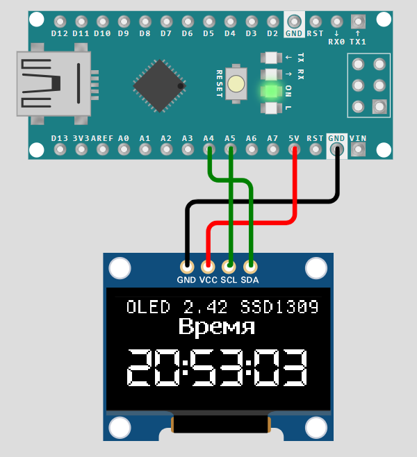
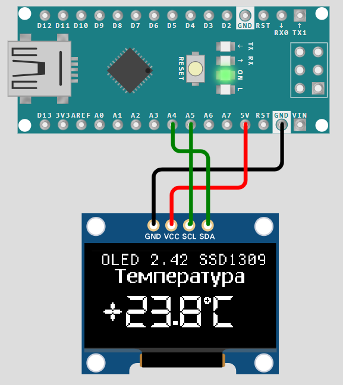
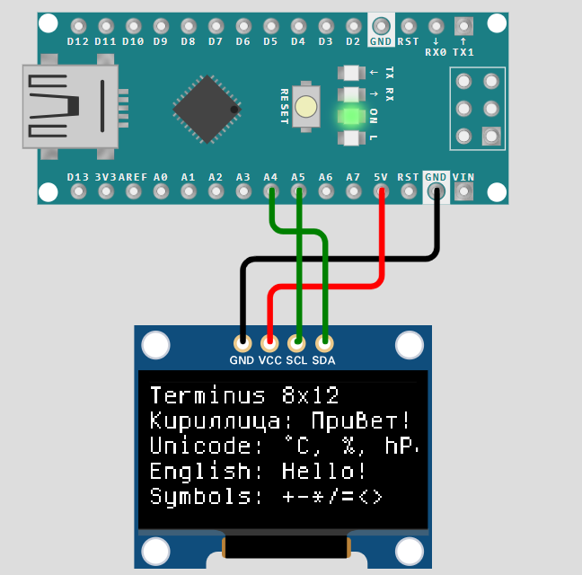

# 📺 OLED2.42_EASY

[](https://github.com/klenov1900-lang/OLED2.42_EASY/releases)
[](LICENSE)
[](https://www.arduino.cc/)
[](https://www.microchip.com/en-us/products/microcontrollers-and-microprocessors/8-bit-mcus/avr-mcus)
[](https://github.com/klenov1900-lang/OLED2.42_EASY)
[](https://www.arduino.cc/reference/en/libraries/)

**Языки:** Русский · [中文](README_CN.md)

---

Простая библиотека для **OLED 2.42"** на контроллере **SSD1309** (I2C, ATmega328P).

Прямая работа с регистрами **TWI**. Без внешних зависимостей.

---

## 🖼️ Демонстрация

Все примеры протестированы в симуляторе [Wokwi](https://wokwi.com/) и реальном "железе" **Arduino Nano** + **OLED 2.42"** на контроллере **SSD1309** , I2C.

| Часы (`Clock_With_Labels`) | Датчики (`FullDemo`) | Шрифт Terminus (`Text_SmallFont`) |
|:---:|:---:|:---:|
|  |  |  |

> 🧪 *Библиотека проверена в Wokwi на SSD1306 — команды совместимы с SSD1309, поэтому код работает без изменений на реальном "железе" **Arduino Nano** + **OLED 2.42"** на контроллере **SSD1309** , I2C.*

---

## 📦 Установка

### 1️⃣ Через менеджер библиотек Arduino IDE (рекомендуется)

1. Откройте Arduino IDE.
2. Перейдите в **Скетч → Подключить библиотеку → Управлять библиотеками…**
3. В поиске введите `OLED2.42_EASY`.
4. Нажмите **Установить**.

> ⚠️ **Пользователям из России:** если менеджер библиотек выдаёт ошибку
> `Возникла ошибка при загрузке https://downloads.arduino.cc/libraries/library_index.json`,
> значит, сервер Arduino недоступен из вашей сети. Используйте **Способ 2 (вручную через ZIP)** —
> он работает независимо от блокировок.

---

### 2️⃣ Вручную (через ZIP) — работает всегда

1. Скачайте ZIP-архив с [последней версией](https://github.com/klenov1900-lang/OLED2.42_EASY/archive/refs/heads/main.zip).
2. В Arduino IDE: **Скетч → Подключить библиотеку → Добавить .ZIP библиотеку…**
3. Выберите скачанный архив.

После этого библиотека появится в меню **Скетч → Подключить библиотеку → OLED2.42_EASY**.

---

### 3️⃣ Через Git

**Linux / macOS:**

```bash
cd ~/Arduino/libraries/
git clone https://github.com/klenov1900-lang/OLED2.42_EASY.git
```

**Windows (PowerShell / CMD):**

```powershell
cd "$env:USERPROFILE\Documents\Arduino\libraries"
git clone https://github.com/klenov1900-lang/OLED2.42_EASY.git
```

После клонирования **перезапустите Arduino IDE** — библиотека появится в меню
**Скетч → Подключить библиотеку → OLED2.42_EASY**.

> 💡 Для обновления до последней версии достаточно выполнить `git pull` в папке библиотеки.

---

### ✅ Как проверить, что всё установилось

1. Откройте Arduino IDE.
2. Перейдите в **Файл → Примеры → OLED2.42_EASY**.
3. Должны быть видны три примера:
   - `Clock_With_Labels`
   - `FullDemo`
   - `Text_SmallFont`
4. Откройте любой из них и нажмите **Проверить/Компилировать**.
5. Если компиляция прошла без ошибок — библиотека установлена корректно.

---

### 🧪 Симуляция без железа

Если у вас нет физического дисплея, библиотеку можно проверить в онлайн-симуляторе
[**Wokwi**](https://wokwi.com/) — поддерживается Arduino Nano + SSD1309 (I2C).
Пример `Text_SmallFont` успешно работает в симуляторе.

---

## ✨ Особенности

| Возможность | Описание |
|---|---|
| 🔌 **Прямая работа с TWI** | Без `Wire.h`, только регистры ATmega328P |
| 💾 **Framebuffer** | 1024 байта (8 страниц по 128 байт) |
| 🔤 **Terminus 8×12** | Кириллица + Unicode (227 символов) |
| 🔢 **Blocky 15×23** | Цифры, знаки, `hPa`, `%`, `°C`, `U`, `A` |
| 🌐 **Мультиязычность** | Заголовки (labels): русский, English, 中文 |
| ⚡ **Частичное обновление** | `oledShowPage()` — только изменённые страницы |
| 🎯 **`*Full` + `*Update`** | Координаты задаются один раз, обновление — без них |
| ⏱️ **Timeout в TWI** | Не зависает при отвале дисплея |

---

## 🔌 Подключение

| OLED | Arduino Nano |
|---|---|
| **VCC** | 5V |
| **GND** | GND |
| **SCL** | A5 |
| **SDA** | A4 |

> ✅ На модуле **встроенный стабилизатор 5V → 3.3V**, поэтому питание от **5V** Arduino **безопасно**.

---

## 🚀 Быстрый старт

```cpp
#include <OLED2.42_EASY.h>

void setup() {
    oledBegin();
    oledClear();

    oledTimeFull(12, 34, 56, 0, 0, 0, 16, 0);
    oledShow();
}

void loop() {
    static uint8_t hh = 12, mm = 34, ss = 56;
    static uint32_t lastUpdate = 0;
    static uint8_t firstRun = 1;

    if (firstRun || (millis() - lastUpdate >= 1000)) {
        lastUpdate = millis();
        firstRun = 0;

        if (++ss >= 60) {
            ss = 0;
            if (++mm >= 60) {
                mm = 0;
                if (++hh >= 24) hh = 0;
            }
        }

        oledTimeUpdate(hh, mm, ss);
    }
}
```

---

## 📖 Три способа вывода значения

### 1️⃣ Просто — фиксированные Y (`pos = 1/2`)

```cpp
oledTemp(23.5, 0, 1);   // Y = 8
oledHumid(67, 0, 2);    // Y = 40
oledShow();
```

| `pos` | Y |
|---|---|
| `1` | 8 |
| `2` | 40 |

### 2️⃣ Гибко — любая пиксельная Y

```cpp
oledTempXY(23.5, 0, 16);   // Y = 16
oledHumidXY(67, 0, 40);    // Y = 40
oledShow();
```

### 3️⃣ С заголовком — `*Full` запоминает координаты

```cpp
// Заголовок Y = 0, значение Y = 16, язык = 0 (рус)
oledTempFull(23.5, 0, 0, 0, 16, 0);
oledShow();

// Обновление — БЕЗ координат
oledTempUpdate(23.6);
```

---

## 🌐 Языки

| Код | Язык |
|---|---|
| `0` | 🇷🇺 Русский |
| `1` | 🇬🇧 English |
| `2` | 🇨🇳 中文 |

```cpp
oledTempFull(23.5, 0, 0, 0, 16, 0);   // русский
oledTempFull(23.5, 0, 0, 0, 16, 1);   // English
oledTempFull(23.5, 0, 0, 0, 16, 2);   // 中文
```

---

## 📋 Полный список функций

### ⚙️ Инициализация

| Функция | Описание |
|---|---|
| `oledBegin()` | Инициализация |
| `oledBeginAddr(addr)` | Инициализация с другим адресом |

### 🖥️ Управление дисплеем

| Функция | Описание |
|---|---|
| `oledOn()` / `oledOff()` | Вкл / выкл |
| `oledContrast(v)` | Контраст (0..255) |
| `oledInvert(e)` | Инверсия (0/1) |

### 💾 Framebuffer

| Функция | Описание |
|---|---|
| `oledClear()` | Очистка всего буфера |
| `oledClearPage(p)` | Очистка страницы 0..7 |
| `oledShow()` | Отправка всего буфера |
| `oledShowPage(p)` | Отправка страницы 0..7 |

### 🎨 Графика

| Функция | Описание |
|---|---|
| `oledPixel(x, y)` | Пиксель |
| `oledLine(x0, y0, x1, y1)` | Линия |
| `oledRect(x, y, w, h)` | Прямоугольник |
| `oledFillRect(x, y, w, h)` | Залитый прямоугольник |
| `oledCircle(x, y, r)` | Круг |
| `oledFillCircle(x, y, r)` | Залитый круг |
| `oledBitmap(bmp, x, y, w, h)` | Битмап |
| `oledInvertRect(x, y, w, h)` | Инверсия области |

### ✍️ Текст

| Функция | Описание |
|---|---|
| `oledText(str, x, line)` | Terminus 8×12, строка 0..4 |
| `oledValue(str, x, pos)` | Blocky, pos = 1/2 |
| `oledValueXY(str, x, y)` | Blocky, пиксельная Y |

### 📊 Значения с единицами (`pos = 1/2`)

| Функция | Формат |
|---|---|
| `oledTemp(t, x, pos)` | `+23.5°C` |
| `oledHumid(h, x, pos)` | `67%` |
| `oledPressure(p, x, pos)` | `1013hPa` |
| `oledVolt(v, x, pos)` | `+3.1U` |
| `oledAmper(a, x, pos)` | `+1.2A` |
| `oledTime(h, m, s, x, pos)` | `12:34:56` |
| `oledDate(d, m, y, x, pos)` | `25.09.26` |

### 📐 Значения с пиксельными координатами

| Функция | Формат |
|---|---|
| `oledTempXY(t, x, y)` | `+23.5°C` |
| `oledHumidXY(h, x, y)` | `67%` |
| `oledPressXY(p, x, y)` | `1013hPa` |
| `oledVoltXY(v, x, y)` | `+3.1U` |
| `oledAmperXY(a, x, y)` | `+1.2A` |
| `oledTimeXY(h, m, s, x, y)` | `12:34:56` |
| `oledDateXY(d, m, y, x, y)` | `25.09.26` |

### 🎯 Полные функции (`*Full`)

| Функция | Параметры |
|---|---|
| `oledTempFull(t, hx, hy, vx, vy, lang)` | 6 |
| `oledHumidFull(h, hx, hy, vx, vy, lang)` | 6 |
| `oledPressFull(p, hx, hy, vx, vy, lang)` | 6 |
| `oledVoltFull(v, hx, hy, vx, vy, lang)` | 6 |
| `oledAmperFull(a, hx, hy, vx, vy, lang)` | 6 |
| `oledTimeFull(h, m, s, hx, hy, vx, vy, lang)` | 8 |
| `oledDateFull(d, m, y, hx, hy, vx, vy, lang)` | 8 |

### 🔄 UPDATE-функции (`*Update`)

| Функция | Описание |
|---|---|
| `oledTempUpdate(t)` | Обновление температуры |
| `oledHumidUpdate(h)` | Обновление влажности |
| `oledPressUpdate(p)` | Обновление давления |
| `oledVoltUpdate(v)` | Обновление напряжения |
| `oledAmperUpdate(a)` | Обновление тока |
| `oledTimeUpdate(h, m, s)` | Обновление времени |
| `oledDateUpdate(d, m, y)` | Обновление даты |

---

## 🔤 Шрифты

| Шрифт | Размер | Назначение | Кириллица |
|---|---|---|---|
| 🔤 **Terminus 8×12** | 8×12 | Текст, заголовки | ✅ |
| 🔢 **Blocky 15×23** | 15×23 | Значения (цифры) | ❌ |

---

## 💾 Потребление ресурсов

| Ресурс | Занято | Свободно |
|---|---|---|
| ⚡ **Flash** | ~7.8 КБ (25%) | ~23 КБ |
| 💾 **ОЗУ** | ~1.1 КБ (52%) | ~0.9 КБ |

---

## 📂 Структура

```
OLED2.42_EASY/
├── src/
│   ├── OLED2.42_EASY.h
│   ├── OLED2.42_EASY.cpp
│   ├── fonts.h
│   ├── blocky_font.cpp
│   ├── fonts_terminus_8x12.c
│   └── labels.h
├── examples/
│   ├── Clock_With_Labels/
│   ├── FullDemo/
│   └── Text_SmallFont/
├── images/
│   ├── Clock_With_Labels.png
│   ├── Demo.png
│   └── Text_SmallFont.png
├── library.properties
├── keywords.txt
├── README.md
└── LICENSE
```

---

## 📜 Лицензия

**MIT** — свободно для коммерческого и некоммерческого использования.

---

## 🙏 Credits

### 🔢 Blocky 15×23

**Автор:** klenov1900-lang
**Лицензия:** MIT

### 🈶 中文 заголовки (`labels.h`)

**Автор:** klenov1900-lang
**Лицензия:** MIT

### 🔤 Terminus 8×12

**Автор:** Dimitar Zhekov
**Лицензия:** SIL Open Font License 1.1
**Источник:** files.ax86.net/terminus-ttf
